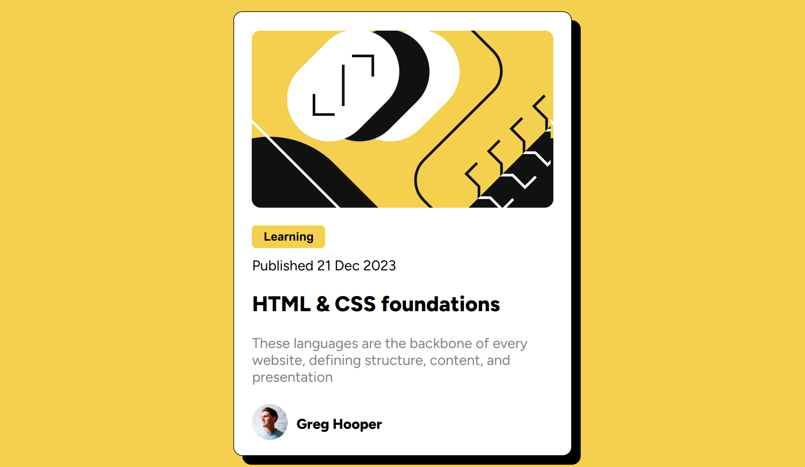

# Frontend Mentor - Blog preview card solution

## Hello there! I am Christian Ortiz 👋

This is my solution to the [Blog preview card challenge on Frontend Mentor](https://www.frontendmentor.io/challenges/blog-preview-card-ckPaj01IcS). These challenges help me improve my coding skills by building realistic projects.

## Table of contents

- [Overview](#overview)
  - [The challenge](#the-challenge)
  - [Screenshot](#screenshot)
  - [Links](#links)
- [My process](#my-process)
  - [Built with](#built-with)
  - [What I learned](#what-i-learned)
  - [Continued development](#continued-development)
  - [Useful resources](#useful-resources)
- [Author](#author)
- [Acknowledgments](#acknowledgments)

## Overview

This is my solution to the challenge from Frontendmentor. I used vanilla HTML and CSS specifically flexbox.

Date Started: December 27, 2023
Date Finished: December 28, 2023

### The challenge

Users should be able to:

- See hover and focus states for all interactive elements on the page

### Screenshot



### Links

- Solution URL: [Add solution URL here](https://github.com/progchris00/FrontendMentor-Challenges/tree/main/BlogPreviewCard)
- Live Site URL: [Add live site URL here](https://progchris00.github.io/FrontendMentor-Challenges/BlogPreviewCard/)

## My process

### Built with

- HTML
- CSS
- Flexbox

### What I learned

Use this section to recap over some of your major learnings while working through this project. Writing these out and providing code samples of areas you want to highlight is a great way to reinforce your own knowledge.

To see how you can add code snippets, see below:

```html
<h1>Some HTML code I'm proud of</h1>
```
```css
.proud-of-this-css {
  color: papayawhip;
}
```
```js
const proudOfThisFunc = () => {
  console.log('🎉')
}
```

If you want more help with writing markdown, we'd recommend checking out [The Markdown Guide](https://www.markdownguide.org/) to learn more.

**Note: Delete this note and the content within this section and replace with your own learnings.**

### Continued development

Use this section to outline areas that you want to continue focusing on in future projects. These could be concepts you're still not completely comfortable with or techniques you found useful that you want to refine and perfect.

**Note: Delete this note and the content within this section and replace with your own plans for continued development.**

### Useful resources

- [Example resource 1](https://www.example.com) - This helped me for XYZ reason. I really liked this pattern and will use it going forward.
- [Example resource 2](https://www.example.com) - This is an amazing article which helped me finally understand XYZ. I'd recommend it to anyone still learning this concept.

**Note: Delete this note and replace the list above with resources that helped you during the challenge. These could come in handy for anyone viewing your solution or for yourself when you look back on this project in the future.**

## Author

- Linkedin - [Christian Ortiz](https://www.linkedin.com/in/christian-ortiz-b45b39256/)
- Frontend Mentor - [@progchris00](https://www.frontendmentor.io/profile/progchris00)
- Github - [progchris00](https://github.com/progchris00)

## Acknowledgments

I would like to thank freeCodeCamp and Flexbox Froggy as my main sources of knowledge about frontend development and flexbox in general.